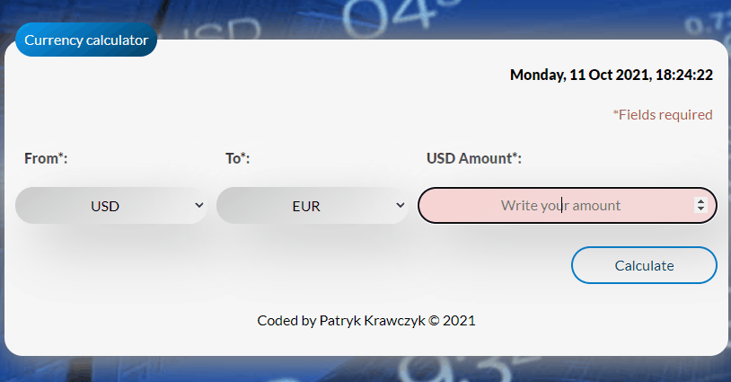

# Currency Calculator

This project was bootstrapped with [Create React App](https://github.com/facebook/create-react-app).

- Author: Patryk Krawczyk
- Created: 10-09-2021
- Upadate: 23-10-2021

## Preview and demo

Here you can find -> [**Demo**](https://patrick36212.github.io/react-currency-calculator/)

## Technologies used in project

- `HTML`
- `BEM`
- `CSS`
- `Flex/Grid`
- `Transition`
- `Media query`
- `JS/ES6+`
- `Immiutability`
- `Babel`
- `React`
- `Styled Components`
- `GlobalStyles & Theme`
- `useState`
- `useEffect`
- `Custom Hooks`

## Functionality

1. Choose your currency
2. Choose currency to exchange
3. Press `Calculate` button
4. Write down amount, you want to exchange in `Amount` input area
5. Your result is showing below
   
   Currencies rates:
   - EUR = 4.4278
   - CHF = 4.2525
   - USD = 3.9012
   - GPB = 5.3782
## Available Scripts

In the project directory, you can run:

### `npm start`

Runs the app in the development mode.\
Open [http://localhost:3000](http://localhost:3000) to view it in the browser.

The page will reload if you make edits.\
You will also see any lint errors in the console.

### `npm run build`

Builds the app for production to the `build` folder.\
It correctly bundles React in production mode and optimizes the build for the best performance.

The build is minified and the filenames include the hashes.\
Your app is ready to be deployed!

See the section about [deployment](https://facebook.github.io/create-react-app/docs/deployment) for more information.

